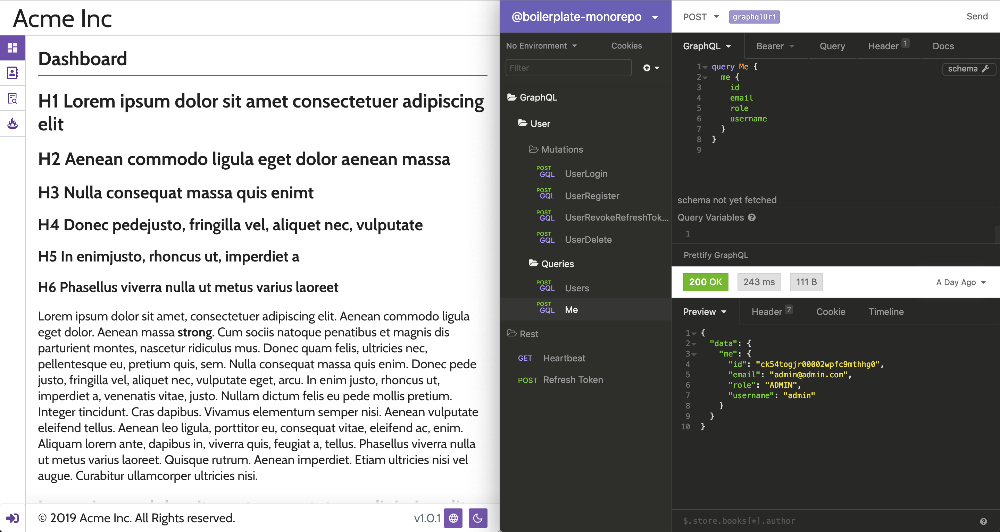

# @boilerplate-monorepo

[](https://circleci.com/gh/n8io/boilerplate-monorepo/tree/master)

A monorepo setup for winning



## 🗳️ What's in the box?

-  Postgres (database)
-  GraphQL (service)
-  React (ui)

## ⚙️ System Requirements

1. <a href="https://docker.com"> Docker</a> v19.03+
2. <a href="https://nodejs.org"> Node</a> v12.13.0+
3. <a href="https://yarnpkg.com"> Yarn</a> v1.19.1+

## 🍔 Recommended Tooling

- <a href="https://insomnia.rest"> Insomnia</a> v7.0.6+
  - Easily call `GraphQL` queries/mutations
  - Make `REST` calls too!
  - Take a tour of our schema with built-in `Docs`
  - Load up the [config](packages/service/insomnia/config.yaml) and go!

## 🏎 Getting Started

```bash
# 1. ⬇️ Clone this repo
git clone git@github.com:n8io/boilerplate-monorepo.git

# 2. 🛠️ Generate local environment variable files
(
  cd packages \
  cp -n service/.env.example service/.env \
  cp -n ui/.env ui/.env.local \
  ;
)

# 3. 🌱 Install dependencies
yarn
```

## 🤓 Development Experience

We've got two choices for local development. With Docker or natively. Each have their own pros and cons depending on whatever flavor suits you. Try them both out. You do you boo.

### 🍕 Natively Adhoc

**NOTE** This is the recommended path for `*nix` based operating systems.

```bash
# Start all the things!
yarn start # 👏🤜🤛🍾🥳

# 👆 The above is the same as...
# 👇 starting them all individually below

# Start the db instance
yarn start:dev:db # `yarn stop:db` to stop

# Start the service
yarn start:dev:server # Cmd/Ctrl+C to stop

# Start the ui
yarn start:dev:ui # Cmd/Ctrl+C to stop
```

### 🐳 Dockerized

When you are running into dependency issues across your environments or maybe you want everything running in the background, this path for you. 🍷 Works well with Windows.

```bash
# Start db, service, and UI
yarn dev

# Stop db, service, and UI
yarn down
```

### 🧪 Testing

#### 🏘️ Unit Tests

```shell
# Run all the tests
yarn test

# 👆 The above is the same as...
# 👇 starting them all individually below

# Run & watch `common` tests
(cd packages/common && yarn test:watch)

# Run & watch `ui` tests
(cd packages/ui && yarn test:watch)
```

#### 🌲 End-to-End Tests

This project is setup to run functional tests using [Cypress](https://www.cypress.io).

```shell
# Opens up Cypress test dashboard
yarn e2e:dev
```

### 🗂 Database Migrations

**NOTE** Database migrations are ran adhoc. You must manually run them before using the app.

#### Run existing migrations

```shell
yarn db:migrate
```

#### Rollback a single migration

```shell
yarn db:migrate:down
```

#### Generate a new migration

```shell
yarn db:migrate:gen create-table-foo # the name is up to you
```

Existing migration files can be found in [`packages/service/src/migrations`](packages/service/src/migrations).

### 🧰 Tooling

#### 🎣 Hook Code Generator

There is a handy dandy generator for creating `React` hooks for our `GraphQL` queries/mutations. Give it a try!

```shell
cd packages/tool-hook-generator

# Refresh your schema file
# Make sure your GraphQL server is running before you run this command
yarn codegen # Rerun as needed

# Creates a `useUserRegister` mutation hook
yarn hook:mutation UserRegister

# Creates a `useUserSelf` query hook
yarn hook:query UserSelf
```

## License

[MIT](https://choosealicense.com/licenses/mit/)
